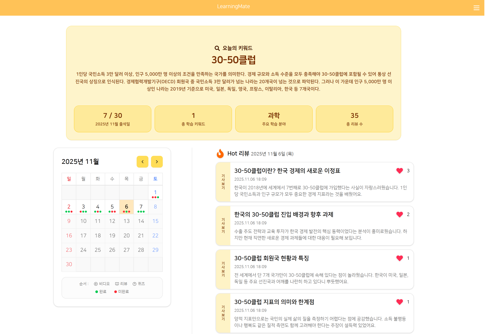
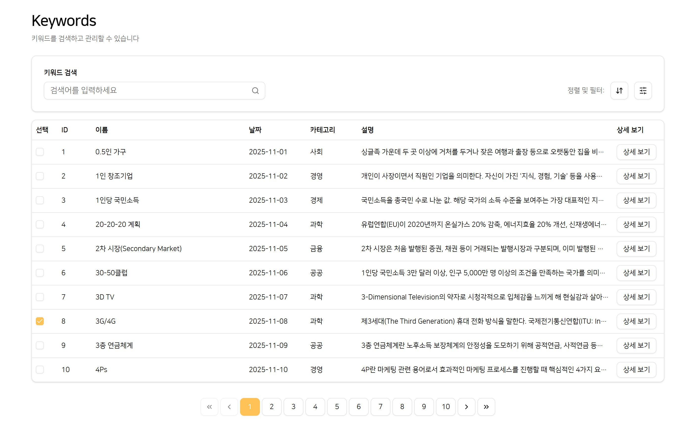
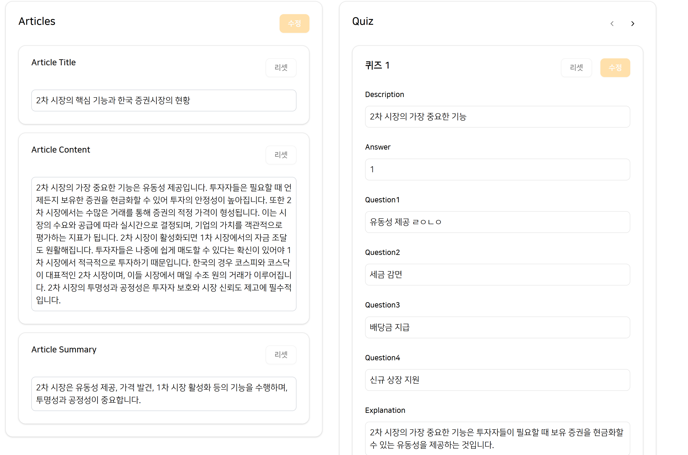

# Learningmate

## 프로젝트 설명

경제 용어 학습을 돕는 AI 기반 학습 플랫폼입니다. 매일 새로운 경제 용어와 관련 학습 컨텐츠(동영상, AI 생성 아티클, 퀴즈)를 제공하여 경제 지식을 체계적으로 쌓을 수 있도록 돕습니다.

**개발 기간**: 2025.8월 ~ 2025.11월

**팀 구성**: 3명

[러닝메이트 사이트 바로가기](https://learningmate.cloud)

## 기술 스택

- React
- Tailwindcss
- Shadcn
- React Router
- Tanstack Query
- Zustand
- React-hook-form
- Zod

## 주요 기능

- AI 를 사용하여 경제 용어 학습을 돕는 아티클 및 퀴즈 생성 및 제공
- 아티클에 대한 리뷰 작성 기능
- 리뷰 좋아요 기능
- 리뷰 조회 시 무한 스크롤 기능
- 사용자의 학습 성취도 통계 조회 기능
- 틀린 퀴즈 보기 기능
- 사용자 인증 기능

## 주요 구현 사항

### 사용자 인증 기능

- **React Hook Form** + **Zod**를 활용한 폼 유효성 검증
- **Axios Interceptor**를 통한 자동 토큰 갱신 로직 구현
- **ContextAPI**로 인증 상태 전역 관리

### 어드민 페이지

- **Tanstack Table**을 활용한 키워드 관리 테이블
  - 디바운스를 사용한 키워드 검색 기능
  - 키워드 필터링, 정렬 및 페이지네이션 기능
- AI 생성 컨텐츠 검수 및 수정 인터페이스
